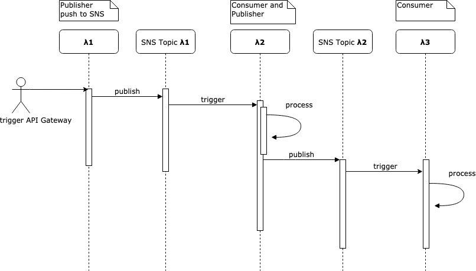

> 👷 This is a simple example that shows up how to do lambda chaining in python + boto3
> 
> Might be used as a skeleton for your task.

## System Design




## Prerequisites
1. Sign up to https://www.serverless.com/
2. Go to dashboard and add app 'serverless-lambda-chaining'
3. Deploy service on your local machine (follow instructions in dashboard)


## Serverless [variables](https://www.serverless.com/framework/docs/providers/aws/guide/variables/) cheetsheet:

Referencing CLI Options
```
serverless deploy --stage dev
in yml:
${opt:stage,'dev'}
```

AWS CloudFormation [Fn::Join](https://docs.aws.amazon.com/AWSCloudFormation/latest/UserGuide/intrinsic-function-reference-join.html)
```
{ "Fn::Join" : ["", ["arn:aws:sns:${self:provider.region}:", { "Ref" : "AWS::AccountId" }, ":${self:custom.mySnsTopic}" ] ]  }
```

Remove serverless services
```
serverles remove
```